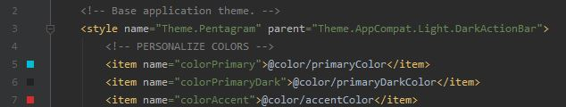
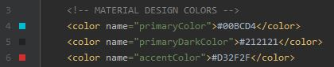
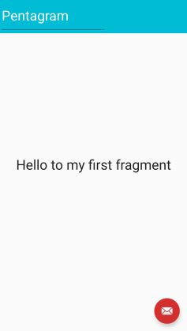
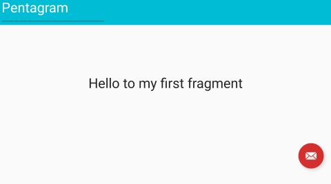

# Pentagram
Una sencilla aplicacion Android desarrollada como evaluacion del curso: **Desarrollo de aplicaciones con Android**, en Cursera.

## Comenzando
En este repositorio se alojaran los archivos necesarios para compilar la aplicacion Pentagram, a lo largo del desarrollo del proyecto se podra visualizar desde este fichero el progreso y novedades incluidas en cada actualizacion.

## Requisitos
La aplicacion esta siendo diseñada con Android Studio 4.1 con el API 23 por lo que, si se desea replicar el proyecto, es indispensable contar con este software.

## Ejecucion de pruebas
- Referencia a los colores del tema empleando *material design* desde el archivo *Themes.xml*

- Definicion de colores *material design* desde el archivo *Colors.xml*

- Resultado en vista vertical

- Resultado en vista en horizontal

