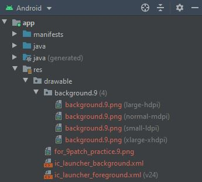

# Pentagram
Una sencilla aplicacion Android desarrollada como evaluacion del curso: **Desarrollo de aplicaciones con Android**, en Cursera.

## COMENZANDO
En este repositorio se alojaran los archivos necesarios para compilar la aplicacion Pentagram, a lo largo del desarrollo del proyecto se podra visualizar desde este fichero el progreso y novedades incluidas en cada actualizacion.

## REQUISITOS
La aplicacion esta siendo diseñada con Android Studio 4.1 con el API 23 por lo que, si se desea replicar el proyecto, es indispensable contar con este software.

## ACTUALIZACIONES
### SOPORTE MULTILENGUAJE
Se han generado 3 variantes de lenguaje: Ingles, frances y aleman.

**Vista desde el directorio strings**

**Strings traducidos**

### REDIMENSION 9PATCH
Para conseguir fondos adaptables a multiples pantallas se crearon 4 imagenes 9patch, todas partiendo de la imagen proporcionada y generando los siguientes parches:

**Division de los parches generados**

### Resultados de la redimension 9patch

**Resultados de la imagen 9patch vistos desde un movil con orientacion portrait**

**Resultados de la imagen 9patch vistos desde un movil con orientacion landscape**

**Resultados de la imagen 9patch vistos desde un TV**

## SOPORTE A MULTIPLES PANTALLAS
El soporte a multiples pantallas se estara proporcionando con imagenes 9patch a diferentes densidades

**Definicion de distintas densidades**

